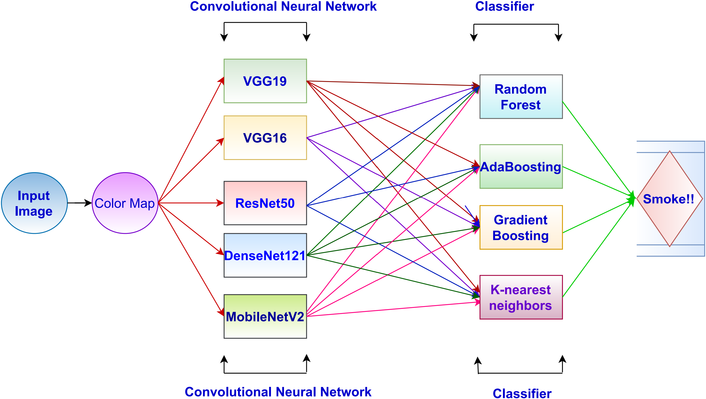

# A Non-Local Weighted Fractional Order Variational Model for Smoke Detection Using Deep Learning Models

**Authors:** Nitish Kumar Mahala, Muzammil Khan, Pushpendra Kumar  

## 📄 [Read the Full Article](https://ieeexplore.ieee.org/abstract/document/10322437)

## Abstract  
<p align="justify">
As we are aware that thousands of fires break out every day around the world, which results in high numbers
of casualties and serious threat to property safety and forest vegetation. Hence, it becomes particularly important to detect
the fire at its early stage, because once the fire has spread in an
area, it gets cataclysmic and difficult to control. In particular, the early detection of fire is associated with rising smoke.
Therefore, the smoke can be considered as a good indicator to predict fire.
</p>
<p align="justify">
In the presented work, smoke detection is performed with the help of its dynamical features. The dynamical
features are considered in the form of optical flow color map. The motivation of this work is to use fractional order optical
flow instead of images to provide the precise location and rate of growth. The estimation of optical flow is carried out using a
non-local weighted fractional order variational model, which is capable in preserving dynamical discontinuities in the optical
flow. Optical flow helps to find the active region of the images (video). This non-local weight also incorporates the robustness
against noise. Further, the optical flow field is converted into a color map using an RGB color wheel. These color maps are
used in different deep learning models for training and testing.
</p>
<p align="justify">
 The experiments are conducted on a dataset consisting of 18
smoke and 17 non-smoke videos. Different accuracy metrics are
used for performance evaluation and detailed comparisons in
order to demonstrate the significance of optical flow color maps
over images in smoke detection.
</p>

## Figure  

**Figure 1:** Proposed framework for fire-smoke detection.

---

## Citation

If you use our code in your research, please consider citing our work using the following BibTeX entry:

```bibtex
@inproceedings{mahala2023non,
  title={A non-local weighted fractional order variational model for smoke detection using deep learning models},
  author={Mahala, Nitish Kumar and Khan, Muzammil and Kumar, Pushpendra},
  booktitle={TENCON 2023-2023 IEEE Region 10 Conference (TENCON)},
  pages={146--151},
  year={2023},
  organization={IEEE}
}
